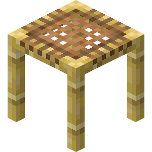

<p align="center">
  
</p>

<p align="center" style="font-size: 32px">Scaffold API</p>
<p align="center">
  A self-hosted <b><a href="https://firebase.google.com/">Firebase</a></b> clone.
</p>

---

This is only the API part. The front-end is being worked on.

## Installation
Currently installation on Docker is available, however we are working on other methods as well.

### Docker
> ❗ Before you start, you need to install <a href="Docker" target="_blank">Docker</a> and <a href="https://nodejs.org" target="_blank">Node.js</a>.

Download or clone this repository, `cd` into it and install packages:
```bash
$ git clone https://github.com/codeiqne/scaffold-api.git
$ cd scaffold-api
$ npm install
```
Then change some variables in `docker-compose.yml`:
- Change `SCAFFOLD_JWT_SECRET` to a randomly generated string

If you want to enable PhpMyAdmin uncomment  these lines in `docker-compose.yml`:
```yml
pma:
  image: phpmyadmin/phpmyadmin
  restart: unless-stopped
  container_name: scaffold-phpmyadmin
  environment:
    - PMA_HOST=scaffold-mariadb
  ports:
    - '5050:80'
  depends_on:
    - db
```
Now you need to migrate the database. Initialize the database by running
```bash
$ docker compose up -d
# Turn off the API
$ docker stop scaffold-api
```
Run migrations and the API using
```bash
$ npm run migration:run
$ docker start scaffold-api
```
Now check the logs of the container. There shouldn't be any errors.
```bash
$ docker logs scaffold-api -f
```
If the last line says `Nest application successfully started` congrats, you are now running a Scaffold API instance. Access it using the port `3000`.
